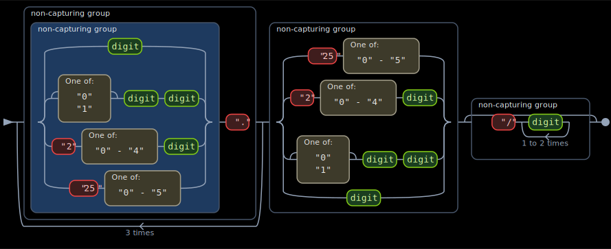
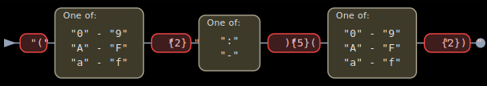
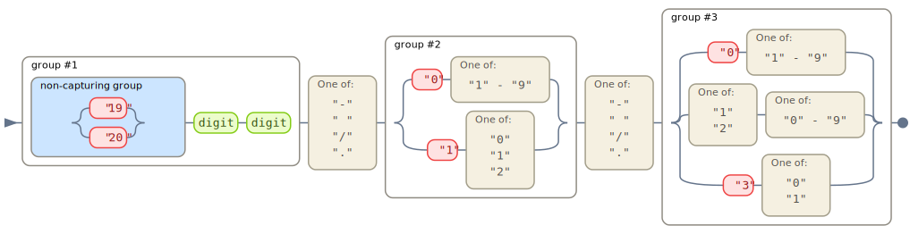
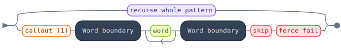
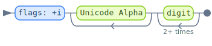
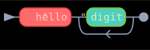

# regolith

A command-line tool for visualizing regular expressions.


## Acknowledgements

regolith began as a fork of [regexper.com](https://regexper.com/) by [Jeff Avallone](https://github.com/javallone).
The railroad diagram visual style, layout approach, and rendering concepts owe a great deal to that project.
regolith has since been rewritten in Go and expanded to support multiple regex flavors beyond JavaScript.

## AI Use Statement

All code in this repository has been generated by Anthropic Claude via Claude Code,
specifically Claude Opus 4.5 and 4.6, as part of an exercise in understanding the
capabilities, cost, and limitations of Large Language Models. I take no credit for 
any code associated with a commit that contains the `[claude]` flag in the
description, or that has been co-authored by Claude.

## Example Results

IPv4 Address:



MAC Address:



ISO-8601 Date format:



PCRE Compliant Regex:



Java Flavored Regex:



Color Customization:



## Features

- Visualize regex patterns as clean SVG railroad diagrams with a
  refreshed visual style — rounded nodes, refined palette, and
  category-aware colors for literals, charsets, escapes, anchors, and
  groups
- **3 output formats**: `text` (ANSI-colored AST walk on stdout, or
  Markdown when redirected to a file), `svg` (railroad diagram), and
  `json` (machine-readable)
- **Built-in themes** for SVG output: catppuccin (mocha, macchiato,
  frappe, latte), gruvbox (dark, light), and several other curated
  palettes — selected with `--theme`
- **ANSI color support** for terminal output with `--color auto`
  (default), `always`, or `never` — severity labels on `analyze`
  findings, bold section headers on the text walk, dimmed literals
  and escapes
- **8 regex flavors** with dedicated PEG grammars:
  - **JavaScript** (ECMAScript 2018+) - including `v` flag unicode sets
  - **Java** (`java.util.regex.Pattern`)
  - **.NET** (`System.Text.RegularExpressions`)
  - **PCRE** (PCRE2) - the most feature-rich flavor
  - **POSIX BRE** (IEEE Std 1003.1)
  - **POSIX ERE** (IEEE Std 1003.1)
  - **GNU grep BRE** (BRE with GNU extensions)
  - **GNU grep ERE** (ERE with GNU extensions, like `grep -E`)
- **`regolith analyze` subcommand**: static analysis of regex patterns
  with findings (catastrophic backtracking, adjacent unbounded
  quantifiers, etc.), runtime benchmarking across corpus types, and
  annotated SVG output
- Customizable colors and dimensions
- String literal unescaping for Java/.NET patterns copied from source code

## Installation

### From Source

```bash
go install github.com/0x4d5352/regolith/cmd/regolith@latest
```

### Build from Repository

```bash
git clone https://github.com/0x4d5352/regolith.git
cd regolith
make build
```

## Usage

### Basic Usage

```bash
# Print an ANSI-colored walk of the regex on stdout (default)
regolith 'a|b|c'

# Write a Markdown outline to a file
regolith 'a|b|c' -o outline.md

# Render an SVG railroad diagram (requires -o / --output)
regolith --format svg -o diagram.svg '[a-z]+'

# Read pattern from stdin
echo '^hello$' | regolith
```

### Output Formats

`regolith` produces three output formats. The default is `text`, which
writes an ANSI-colored walk of the AST to stdout — and automatically
switches to Markdown when redirected to a file via `-o`. The `svg`
format always requires an explicit `-o` destination.

```bash
# Text walk on stdout (default)
regolith 'a|b|c'

# Same walker, written as Markdown when -o points at a file
regolith 'a|b|c' -o outline.md

# SVG railroad diagram — always requires -o
regolith --format svg -o diagram.svg '[a-z]+'

# JSON AST dump - writes to stdout, pipe to jq
regolith --format json 'foo([a-z]+)' | jq .

# Combine with stdin and flavors
echo '[a-z]+' | regolith --format json --flavor pcre
```

### Selecting a Flavor

```bash
# JavaScript (default) - supports /pattern/flags syntax
regolith --flavor javascript '/pattern/gi'

# Java
regolith --flavor java '(?i)\p{Alpha}+\d{2,}'

# .NET - balanced groups, variable-length lookbehind
regolith --flavor dotnet '(?<open>\().*?(?<close-open>\))'

# PCRE - recursive patterns, callouts, backtracking control
regolith --flavor pcre '(?R)|(?C1)\b\w+\b(*SKIP)(*FAIL)'

# POSIX BRE - uses \( \) for groups
regolith --flavor posix-bre '\([[:alpha:]]\{2,\}\)'

# POSIX ERE
regolith --flavor posix-ere '([[:alpha:]]{2,})'

# GNU grep BRE (also available as just "gnugrep")
regolith --flavor gnugrep-bre '\bword\b'

# GNU grep ERE
regolith --flavor gnugrep-ere '\b[[:digit:]]+\b'
```

### String Literal Unescaping

When copying regex patterns from Java or .NET source code, backslashes are doubled. Use `--unescape` to handle this:

```bash
# Pattern from Java source: "\\d+\\.\\d+"
regolith --flavor java --unescape '\\d+\\.\\d+'
```

### Analyzing a Pattern

The `regolith analyze` subcommand runs static analysis on a pattern
and, optionally, runtime benchmarks. Output defaults to ANSI-colored
text on stdout. Redirecting to a file via `-o` switches the text
output to Markdown; `--format json` emits structured findings;
`--format svg` produces an annotated railroad diagram with severity
badges layered on the offending nodes.

```bash
# Static findings only (e.g., catastrophic backtracking warnings)
regolith analyze '.*.*=.*'

# Include a runtime benchmark across all built-in corpus types
regolith analyze --benchmark '(a+)+b'

# Filter by minimum severity and emit JSON
regolith analyze --severity warning --format json '(.*)+'

# Annotated SVG with severity badges
regolith analyze --format svg -o annotated.svg '(a|a)*b'
```

Benchmarking flags:
- `--benchmark` — enable runtime measurement
- `--timeout` — per-input timeout (default `5s`)
- `--corpus` — corpus types: `prose`, `json`, `yaml`, `repeated`, `random`, or `all` (default)
- `--sizes` — input sizes for benchmarking (default `10,100,1000,10000,100000`)
- `--severity` — filter findings: `info`, `warning`, `error`, `critical`

### Customization

#### Themes

`regolith` ships with a set of curated color palettes for SVG output.
Select one with `--theme <name>`:

```bash
regolith --format svg --theme catppuccin-mocha -o out.svg 'foo(bar|baz)'
regolith --format svg --theme gruvbox-dark    -o out.svg '[a-z]+'
```

Available themes:
- `default` — the built-in refreshed palette (same as omitting `--theme`)
- `catppuccin-mocha`, `catppuccin-macchiato`, `catppuccin-frappe`,
  `catppuccin-latte`
- `gruvbox-dark`, `gruvbox-light`
- `pastels-dark`, `pastels-light`
- `high-contrast-dark`, `high-contrast-light`
- `colorblind-dark`, `colorblind-light`

Run `regolith -h` to see the full list with descriptions as discovered
from the theme registry.

A theme replaces the color palette wholesale. Individual color flags
(`--literal-fill`, `--line-color`, etc.) layer on top of a theme, so
you can tint a single category without rebuilding the whole palette.

#### Terminal colors

When writing the default `text` format to stdout, regolith uses ANSI
escape codes for bold section headers and dimmed literals. Behavior is
controlled by `--color`:

```bash
regolith --color auto   'a|b|c'   # default — colored on TTY, plain when piped
regolith --color always 'a|b|c'   # force ANSI codes even through pipes
regolith --color never  'a|b|c'   # plain output even on a TTY
```

The same flag applies to the `analyze` subcommand's text output and
to the parser error messages.

#### Colors

```bash
regolith --format svg --literal-fill '#ff6b6b' --escape-fill '#4ecdc4' -o out.svg 'hello\d+'
```

Available color flags (defaults reflect the refreshed palette):
- `--text-color` - Fallback text color (default: `#000`)
- `--line-color` - Connector / loop line color (default: `#64748b`)
- `--literal-fill` - Literal box fill (default: `#fee2e2`)
- `--charset-fill` - Character set box fill (default: `#f5f0e1`)
- `--escape-fill` - Escape sequence box fill (default: `#ecfccb`)
- `--anchor-fill` - Anchor box fill (default: `#334155`)
- `--subexp-fill` - Outermost subexpression fill (default: `none`; nested groups cycle through distinct colors)

#### Dimensions

```bash
regolith --format svg --padding 20 --font-size 16 --line-width 3 -o out.svg 'pattern'
```

Available dimension flags:
- `--padding` - Padding around diagram (default: `10`)
- `--font-size` - Font size in pixels (default: `13`)
- `--line-width` - Stroke width for connectors and loops (default: `1.5`)

## Supported Features by Flavor

| Feature | JS | Java | .NET | PCRE | POSIX BRE | POSIX ERE | GNU BRE | GNU ERE |
|---------|----|------|------|------|-----------|-----------|---------|---------|
| Literals & alternation | x | x | x | x | x | x | x | x |
| Character classes | x | x | x | x | x | x | x | x |
| POSIX classes (`[:alpha:]`) | | x | | x | x | x | x | x |
| Quantifiers (`*+?{n,m}`) | x | x | x | x | x | x | x | x |
| Non-greedy quantifiers | x | x | x | x | | | | |
| Possessive quantifiers | | x | x | x | | | | |
| Capture groups | x | x | x | x | x | x | x | x |
| Named groups | x | x | x | x | | | | |
| Non-capture groups | x | x | x | x | | x | | x |
| Lookahead | x | x | x | x | | | | |
| Lookbehind | x | x | x | x | | | | |
| Variable-length lookbehind | | | x | | | | | |
| Atomic groups | | x | x | x | | | | |
| Back-references | x | x | x | x | x | | x | x |
| Unicode properties (`\p{}`) | x | x | x | x | | | | |
| Unicode sets (v-flag) | x | | | | | | | |
| Inline modifiers (`(?i)`) | | x | x | x | | | | |
| Comments (`(?#...)`) | | x | x | x | | | | |
| Conditional patterns | | | x | x | | | | |
| Recursive patterns | | | | x | | | | |
| Balanced groups | | | x | | | | | |
| Branch reset (`(?\|...)`) | | | | x | | | | |
| Backtracking control | | | | x | | | | |
| Callouts | | | | x | | | | |
| Script runs | | | | x | | | | |
| `\Q...\E` quoted literals | | x | x | x | | | | |

## Contributing

Development setup, parser generation workflow, golden-test
conventions, project structure, and the pull-request process all
live in [CONTRIBUTING.md](./CONTRIBUTING.md). Please read it before
opening a pull request.

## Architecture

regolith uses a parse-then-render pipeline: **PEG grammar -> AST -> SVG / JSON / text**.

1. Each regex flavor defines a PEG grammar that produces a shared AST
2. Flavors register themselves via `init()` and are discovered through a central registry
3. The `--format` flag selects the output backend:
   - **text** — AST walker produces an outline; ANSI-styled on stdout,
     Markdown when redirected to a file via `-o`. Default format.
   - **svg** — renderer walks the AST and produces SVG elements with
     bounding box calculations and railroad-style paths. Themes and
     individual color overrides layer on top of the default palette.
     Requires `-o` with a destination filename.
   - **json** — structured dump with a stable consumer-friendly schema
     (discriminated union via `type` field)
4. `regolith analyze` adds a static analysis pass after parsing, with
   optional runtime benchmarking. Its output routes through the same
   text/json/svg backends (annotated SVG overlays severity badges on
   the offending nodes).

## License

MIT License - see [LICENSE](LICENSE) for details.
